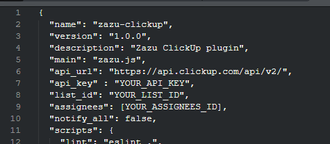

## Zazu ClickUp
This workflow allows you to use [Zazu](http://zazuapp.org/) to quickly add tasks and search tasks within ClickUp 2.0.

This is a adaptation of the very well made [Alfred Workflow](https://github.com/mschmidtkorth/alfred-clickup-msk) made by [@mschmidtkorth](https://github.com/mschmidtkorth) to work with Zazu, a alternative to Alfred (a mac exclusive app).
I've just "translated" his Python to JS and made it work.
This is a personal project so is highly customized to my needs and many functions were removed from the original Alfred Workflow (Tags and list support, search tasks, list created tasks and more)

## Installation & Requirements
For this you need

- [ClickUp 2.0](https://docs.clickup.com/en/articles/3005140-guide-to-switching-to-2-0) (will not work with 1.0)
- [Zazu installed](http://zazuapp.org/)

To install, open you Zazu config and add: ``` "fabiomsnunes/zazu-clickup", ``` to your json, inside "plugins" object. 

After that, right click on Zazu and update plugins.
Your new plugin should be installed in ``` C:\Users\%username%\.zazu\plugins\ ```.

if not, just download the [latest release](https://github.com/fabiomsnunes/zazu-clickup/releases/latest) and open the export the zip to that folder.

## Configuration
Before being able to connect to ClickUp, certain parameters need to be configured.
Open: `C:\Users\%username%\.zazu\plugins\fabiomsnunes\zazu-clickup\package.json` and change the values:

| Configuration setting         | Description                                                                                                                                                                                                                                                                                                      | Example                |
| ----------------------------- | ---------------------------------------------------------------------------------------------------------------------------------------------------------------------------------------------------------------------------------------------------------------------------------------------------------------- | ---------------------- |
| *api_key*             | API token generated in ClickUp (either a public token or a private SSO token). Allows us to connect to your ClickUp account.<br>Can be retrieved from *ClickUp app > Profile Icon (bottom left) > Apps > Generate API key*<br> *Note:* Treat this key as your password. | `pk_12345_sdhu2348...` |
| *list_id* | Id of the List you want new tasks to be added to by default.                                                                                                                                                                                                                                                     | `4696187`              |
| *assignees*                 | IDs of the users you want to assign the tasks to. Usually it's just your ID but you can assign more than one.                                                                                                                                                                                                              | `1234567`      |

## Usage & Commands

### Creating Tasks

Tasks can be created by providing a title and optional commands.

```text
   cu <Title> [:<Description>] [@<Due Date>] [_<Time Estimate>] [!<Priority>]
```

- Press `Enter` to create the task.

Commands let you add additional information to your task:

- Commands are added via one-character shortcuts
  - `:` **Description** of a task (max. 1 possible)
  - `@` **Due date** of a task (max. 1 possible).
    - `m<number>` Task is due in `<number>` minutes
    - `h<number>` Task is due in `<number>` hours
    - `d<number>` Task is due in `<number>` days
    - `w<number>` Task is due in `<number>` weeks
    - `mon` or `monday` Task is due for next Monday (same for other days)
    - `now` Task is due now
    - `tod` or `today` Task is due for today
    - `tom` or `tomorrow` Task is due for tomorrow
    - `2020-12-31` Task is due on 2020-12-31 at the current time
    - `2020-12-31 14:00` Task is due on 2020-12-31 at 2pm
    - `14:00` Task is due today at 2pm
  - `_` **Time Estimate** of a task (max. 1 possible).
    - `<number>m` Task is estimated to take `<number>` minutes. (You can use `m`, `min`, `minute` or `minutes`)
    - `<number>h` Task is estimated to take `<number>` hours. (You can use `h`, `hour` or `hours`)
    - `<number>d` Task is estimated to take `<number>` days. (You can use `d`, `days` or `days`)
    - `<number>w` Task is estimated to take `<number>` weeks. (You can use `w`, `week` or `weeks`)
  - `!` **Priority** of a task (max. 1 possible). If not specified, priority is None.
    - `!1` Task has a priority of Urgent
    - `!2` Task has a priority of High
    - `!3` Task has a priority of Normal
    - `!4` Task has a priority of Low
- Commands are optional
- Commands are separated by space
- Commands can be in any sequence
- Assignees and notify default values are used (see [Configuration](#configuration))
- *Caveat*: If you want to use `@`, `!` or `_` in either title or content, do not use a space before. Otherwise the character will be identified as a command signifier.


#### Examples

```text
cu Clean the kitchen :Before my wife gets angry @h4 _30m !1
```

> Creates a task titled "Clean the kitchen", with description "Before my wife gets angry", having a priority of "Urgent", due in 4 hours, estimated to last 30 minutes and assigned to your default list.

```text
cu Clean the kitchen
```

> Creates a task titled "Clean the kitchen" assigned to your default list.

## Changelog

- 1.0
  - Initial version, first public release

## Thanks

- The [ClickUp team](http://clickup.com) for providing their API and great responsiveness in case of any questions.
- [@mschmidtkorth](https://github.com/mschmidtkorth/) for his [alfred-clickup-msk](https://github.com/mschmidtkorth/alfred-clickup-msk) made for Alfred (mac)
